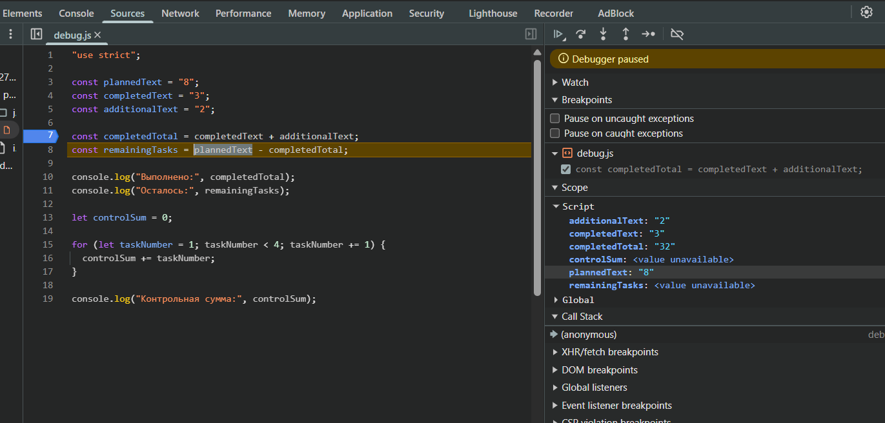

# Отчёт по практической работе № 1

---

## 1. Автор и вариант
* **Студент:** *Хасьянов Тимур Равилевич*
* **Группа:** *ЭФБО-03-25*
* **Вариант:** *3*

---

## 2. Окружение
* **Операционная система:** Windows 11
* **Среда выполнения Node.js:** v24.14.1
* **Менеджер пакетов npm:** 11.11.0
* **Система контроля версий Git:** 2.53.0.windows.2
* **Браузер:** Google Chrome

---

## 3. Запуск программы

### А. Запуск на компьютере через Node.js
Для проверки кода без браузера необходимо открыть терминал в главной папке проекта и ввести команду `node` с путём к нужному файлу:
```bash
node practice-01/js/hello.js
node practice-01/js/types.js
node practice-01/js/progress.js
node practice-01/js/plan.js
node practice-01/js/debug.js
node practice-01/js/progress-input.js
```

### Б. Запуск в браузере (через Live Server)
1. Открыть файл `practice-01/index.html` в редакторе VS Code.
2. Кликнуть по кнопке **Go Live** в правом нижнем углу экрана. Браузер автоматически откроет страницу.
3. **Переключение заданий:** HTML-страница является простым шаблоном, а весь результат выводится в консоль. Чтобы запустить другой скрипт, необходимо зайти в `index.html` и изменить путь в строке подключения файла:
   ```html
   <script src="./js/progress.js" defer></script>
   ```
4. Сохранить файл (`Ctrl + S`), после чего страница в браузере обновится самостоятельно.
5. Нажать клавишу **F12** на клавиатуре и перейти во вкладку **Console (Консоль)** для просмотра всех расчётов, статусов или сообщений об ошибках.


---

## 4. Задание 1: Один файл — две среды выполнения (hello.js)
При запуске `hello.js` финальная строка дала разные результаты:
* **В Node.js:** `Тип document: undefined`
* **В браузере:** `Тип document: object`

---

## 5. Задание 2: Исследование типов и преобразований (types.js)


| Выражение | Ожидание до запуска | Фактическое значение | Тип результата | Объяснение |
| :--- | :--- | :--- | :--- | :--- |
| `"8" + 2` | `"82"` | `"82"` | `string` | При наличии строки оператор `+` выполняет конкатенацию (склеивание) текста. |
| `"8" - 2` | `Ошибка` | `6` | `number` | Оператор `-` не работает со строками, происходит автоматическое приведение к числу. |
| `Number("8") + 2` | `10` | `10` | `number` | Функция `Number()` явно преобразует строку в число `8`, затем идет обычное сложение. |
| `"12" > "3"` | `true` | `false` | `boolean` | Строки сравниваются посимвольно. Код первого символа `"1"` меньше, чем код символа `"3"`. |
| `12 === "12"` | `false` | `false` | `boolean` | Строгое равенство `===` сравнивает без приведения типов. Типы разные, поэтому `false`. |
| `Number("")` | `0` | `0` | `number` | По спецификации языка преобразование пустой строки в число всегда возвращает `0`. |
| `Number("text")` | `NaN` | `NaN` | `number` | Текст невозможно преобразовать в валидное число, поэтому возвращается `NaN`. |
| `Boolean("false")` | `false` | `true` | `boolean` | Функция `Boolean()` превращает любую непустую строку в `true`. Текст строки роли не играет. |
| `typeof null` | `"object"` | `"object"` | `string` | Известная историческая ошибка в самой первой спецификации типа данных JavaScript. |


---

## 6. Задание 3: Сводка выполнения задач (progress.js)

| Проверка | Входные данные | Ожидаемый результат | Фактический результат | Итог |
| :--- | :--- | :--- | :--- | :--- |
| **Обычный случай (мой вариант)** | `totalTasks = 10`<br>`completedTasks = 4` | Всего задач: 10<br>Выполнено: 4<br>Осталось: 6<br>Прогресс: 40.0%<br>Статус: В работе | Всего задач: 10<br>Выполнено: 4<br>Осталось: 6<br>Прогресс: 40.0%<br>Статус: В работе | Пройдено |
| **Обычный случай (тест)** | `totalTasks = 12`<br>`completedTasks = 5` | Всего задач: 12<br>Выполнено: 5<br>Осталось: 7<br>Прогресс: 41.7%<br>Статус: В работе | Всего задач: 12<br>Выполнено: 5<br>Осталось: 7<br>Прогресс: 41.7%<br>Статус: В работе | Пройдено |
| **Граничный случай** | `totalTasks = 0`<br>`completedTasks = 0` | Задач пока нет. | Задач пока нет. | Пройдено |
| **Граничный случай** | `totalTasks = 5`<br>`completedTasks = 0` | Всего задач: 5<br>Выполнено: 0<br>Осталось: 5<br>Прогресс: 0.0%<br>Статус: Не начато | Всего задач: 5<br>Выполнено: 0<br>Осталось: 5<br>Прогресс: 0.0%<br>Статус: Не начато | Пройдено |
| **Граничный случай** | `totalTasks = 5`<br>`completedTasks = 5` | Всего задач: 5<br>Выполнено: 5<br>Осталось: 0<br>Прогресс: 100.0%<br>Статус: Завершено | Всего задач: 5<br>Выполнено: 5<br>Осталось: 0<br>Прогресс: 100.0%<br>Статус: Завершено | Пройдено |
| **Некорректные данные** | `totalTasks = 5`<br>`completedTasks = 6` | Ошибка: выполнено больше, чем существует. | Ошибка: выполнено больше, чем существует. | Пройдено |
| **Некорректные данные** | `totalTasks = -1`<br>`completedTasks = 0` | Ошибка: отрицательное количество. | Ошибка: отрицательное количество. | Пройдено |
| **Некорректные данные** | `totalTasks = 5`<br>`completedTasks = 2.5` | Ошибка: дробное количество задач. | Ошибка: дробное количество задач. | Пройдено |
| **Некорректные данные** | `totalTasks = "5"`<br>`completedTasks = 2` | Ошибка: вместо числа передана строка. | Ошибка: вместо числа передана строка. | Пройдено |
| **Некорректные данные** | `totalTasks = 1001`<br>`completedTasks = 0` | Ошибка: превышена верхняя граница. | Ошибка: превышена верхняя граница. | Пройдено |
| **Некорректные данные** | `totalTasks = NaN`<br>`completedTasks = 0` | Ошибка: недопустимое числовое значение. | Ошибка: недопустимое числовое значение. | Пройдено |

---

## 7. Задание 4: План выполнения задач по дням (plan.js)

| Проверка | Входные данные | Ожидаемый результат | Фактический результат | Итог |
| :--- | :--- | :--- | :--- | :--- |
| **Обычный случай (мой вариант)** | `totalTasks = 10`<br>`completedTasks = 7`<br>`dailyLimit = 3` | Осталось задач: 3<br>День 1: выполнено 3, осталось 0<br>Потребуется дней: 1 | Осталось задач: 3<br>День 1: выполнено 3, осталось 0<br>Потребуется дней: 1 | Пройдено |
| **Обычный случай (тест)** | `totalTasks = 10`<br>`completedTasks = 4`<br>`dailyLimit = 3` | Осталось задач: 6<br>День 1: выполнено 3, осталось 3<br>День 2: выполнено 3, осталось 0<br>Потребуется дней: 2 | Осталось задач: 6<br>День 1: выполнено 3, осталось 3<br>День 2: выполнено 3, осталось 0<br>Потребуется дней: 2 | Пройдено |
| **Граничный случай (лимит больше остатка)** | `totalTasks = 5`<br>`completedTasks = 3`<br>`dailyLimit = 10` | Осталось задач: 2<br>День 1: выполнено 2, осталось 0<br>Потребуется дней: 1 | Осталось задач: 2<br>День 1: выполнено 2, осталось 0<br>Потребуется дней: 1 | Пройдено |
| **Граничный случай (0 дней)** | `totalTasks = 5`<br>`completedTasks = 5`<br>`dailyLimit = 2` | Потребуется дней: 0 | Потребуется дней: 0 | Пройдено |
| **Граничный случай (0 задач)** | `totalTasks = 0`<br>`completedTasks = 0`<br>`dailyLimit = 2` | Задач пока нет. | Задач пока нет. | Пройдено |
| **Некорректные данные** | `totalTasks = 5`<br>`completedTasks = 2`<br>`dailyLimit = 0` | Ошибка: дневная норма должна быть от 1 до 1000. | Ошибка: дневная норма должна быть от 1 до 1000. | Пройдено |
| **Некорректные данные** | `totalTasks = 5`<br>`completedTasks = 2`<br>`dailyLimit = 1.5` | Ошибка: дробное количество задач. | Ошибка: дробное количество задач. | Пройдено |
| **Некорректные данные** | `totalTasks = 5`<br>`completedTasks = 6`<br>`dailyLimit = 2` | Ошибка: выполнено больше, чем существует. | Ошибка: выполнено больше, чем существует. | Пройдено |
| **Некорректные данные** | `totalTasks = 5`<br>`completedTasks = 2`<br>`dailyLimit = "2"` | Ошибка: вместо числа передана строка. | Ошибка: вместо числа передана строка. | Пройдено |
| **Некорректные данные** | `totalTasks = 5`<br>`completedTasks = 2`<br>`dailyLimit = 1001` | Ошибка: дневная норма должна быть от 1 до 1000. | Ошибка: дневная норма должна быть от 1 до 1000. | Пройдено |

---

## 8. Задание 5: Поиск логических ошибок через DevTools (debug.js)
Для поиска ошибок в файле `debug.js` использовать вкладку **Sources** в инструментах разработчика браузера (F12).

### А. Исходный и исправленный результат работы

* **Исходный результат (до отладки):**
  ```text
  Выполнено: 32
  Осталось: -24
  Контрольная сумма: 6
  ```
  Вкладка браузера намертво зависала из-за бесконечного цикла.
* **Исправленный результат (после отладки):**
  ```text
  Выполнено: 5
  Осталось: 3
  Контрольная сумма: 10
  ```

### Б. Причины ошибок и как их исправить

1. **Ошибка со строками (`"3" + "2" = "32"`)**
   * *В чём проблема:* Переменные изначально были строками в кавычках. Оператор `+` просто склеил текст `"3"` и `"2"` вместе, получив `"32"`. Из-за этого при вычитании `8 - "32"` программа выдала дикий минус (`-24`).
   * *Как исправить:* Перевести строки в нормальные числа перед сложением с помощью `Number()`.

2. **Сломанный цикл `for`**
   * *В чём проблема:* Из-за условия taskNumber < 4 последняя итерация не выполнялась, из-за чего к контрольной сумме не прибавилась четверка.
   * *Как исправить:* Поставить вместо "<" - "<="

   

---

## 9. Вывод
Освоены базовые скрипты JS, типы данных, условия и циклы. Наиболее показательной оказалась ошибка конкатенации, продемонстрировавшая важность работы с типами данных и отладки.
